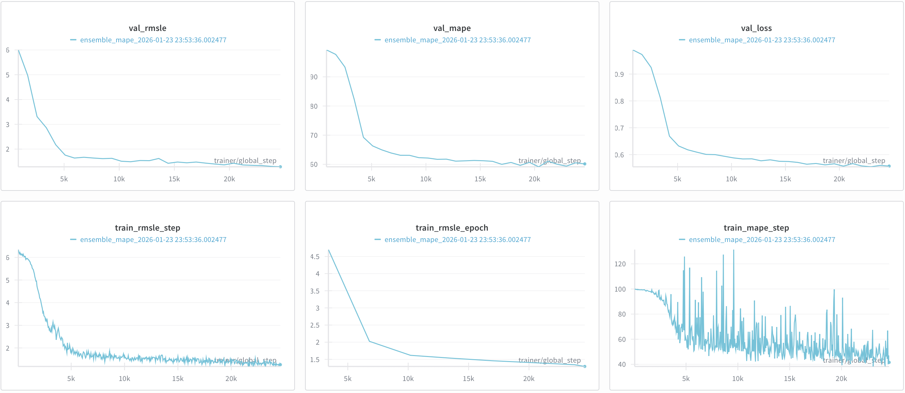

# Product Length Prediction

Predict product length from text metadata. Competition metric: **MAPE** (Mean Absolute Percentage Error).

```
score = max(0, 100 × (1 - MAPE))
```

## Problem

Given product information (title, bullet points, description, product type), predict the physical length.

| Column | Description |
|--------|-------------|
| `TITLE` | Product title |
| `BULLET_POINTS` | Feature bullets |
| `DESCRIPTION` | Full description |
| `PRODUCT_TYPE_ID` | Category identifier |
| `PRODUCT_LENGTH` | **Target** (to predict) |

Reference Dataset: [Kaggle Amazon ML Challenge](https://www.kaggle.com/datasets/ashisparida/amazon-ml-challenge-2023)

---

## My Journey

### 2023 Attempt (Failed)
- Used BERT to encode text → predict length directly
- Ignored `PRODUCT_TYPE_ID` completely
- Result: Expensive, slow, poor performance

### 2026 Reattempt (This Repo)
Key insight: **Product type is a strong signal**, but text embeddings help differentiate within types. Pre-compute embeddings, train a lightweight MLP, and directly optimize for MAPE.

---

## Results

| Metric | Validation | Test |
|--------|------------|------|
| **MAPE** | 59.15% | 57.87% |
| **Score** | 40.85 | **42.13** |
| **RMSLE** | 1.43 | 1.43 |

Training converged in **8 epochs** (~80 minutes on MPS/M1). The model learns to predict values in a reasonable range, though some edge cases remain challenging.

### Sample Predictions

| Predicted | Actual | Error |
|-----------|--------|-------|
| 571.8 | 669.3 | 14.6% |
| 491.6 | 500.0 | 1.7% |
| 628.1 | 614.0 | 2.3% |
| 584.9 | 600.0 | 2.5% |
| 746.0 | 10.0 | 7360% 😅 |

The model performs well on typical products (500-1000 range) but struggles with extreme values.

### Training Curves



---

## Architecture

```
┌──────────────────────────────────────────────────────────┐
│            PRE-COMPUTED TEXT EMBEDDINGS                  │
├────────────┬────────────┬────────────┬────────────┬──────┤
│   MiniLM   │   MPNet    │  DistilUSE │  E5-Small  │ Type │
│    384d    │    768d    │    512d    │    384d    │ 128d │
└─────┬──────┴─────┬──────┴─────┬──────┴─────┬──────┴──┬───┘
      └────────────┴────────────┴─────┬──────┴─────────┘
                                      │ concat (2176d)
                                ┌─────▼─────┐
                                │    MLP    │
                                │ 1024 → 256│
                                │  256 → 64 │
                                │   64 → 1  │
                                └─────┬─────┘
                                      ▼
                                   LENGTH
```

**Total Parameters:** 4.1M (lightweight!)

---

## Key Decisions

| Decision | Why |
|----------|-----|
| **Pre-computed embeddings** | 4 models × 2.2M samples = expensive. Compute once, train fast. |
| **Concatenation** | Preserves information from each embedding model separately |
| **Learnable type embedding** | 12,322 product types → 128d learned representation |
| **Direct MAPE loss** | Aligns training objective with evaluation metric |
| **Mixed precision (FP16)** | 2x faster training on Apple Silicon |

### Why MAPE Loss?

I experimented with different losses:

| Loss | Val MAPE | Notes |
|------|----------|-------|
| Huber (log-space) | 94% | Optimizes RMSLE, not MAPE |
| **MAPE (direct)** | **59%** | Matches evaluation metric |

The key insight: **train for what you're measured on**. Huber loss in log-space is smooth and stable, but optimizes the wrong thing.

---

## Training Details

```yaml
Data:
  Train: 1,738,559 samples
  Val: 217,320 samples  
  Test: 217,320 samples
  Product Types: 12,322
  Unique Lengths: 11,299

Model:
  Text Embedding: 2048d (4 models concatenated)
  Type Embedding: 128d (learnable)
  Hidden Layers: [1024, 256, 64]
  Dropout: 0.2
  BatchNorm: Yes

Training:
  Batch Size: 512
  Learning Rate: 1e-3
  Optimizer: AdamW (weight_decay=0.01)
  Scheduler: OneCycleLR
  Epochs: 8 (early stopped)
  Precision: FP16 mixed
```

---

## Post-Processing (Explored)

Tried several post-processing techniques: type-specific snapping, frequency-weighted snapping, blending with type medians. **None improved over raw predictions.** The MAPE-optimized model already produces well-positioned predictions—snapping sometimes moves them away from the true value.

---

## Project Structure

```
├── configs/
│   └── default.yaml        # All hyperparameters
├── scripts/
│   ├── train.py            # Training entrypoint
│   ├── predict.py          # Generate submission
│   └── evaluate_postprocessing.py
├── src/product_length/
│   ├── config.py           # Config dataclasses
│   ├── data/               # Dataset & DataModule
│   ├── models/             # EnsembleModel (LightningModule)
│   ├── training/           # Trainer & callbacks
│   ├── inference/          # Prediction & post-processing
│   └── utils/              # Metrics & helpers
└── notebooks/
    └── eda.ipynb           # Exploratory analysis
```

## Quick Start

```bash
# Extract embeddings (one-time, ~30 min)
python scripts/extract_embeddings.py

# Train
python scripts/train.py --config configs/default.yaml

# Predict
python scripts/predict.py --checkpoint checkpoints/best.ckpt
```

---

## What I Learned

1. **Loss function matters enormously.** Switching from Huber to MAPE dropped error from 94% to 59%.
2. **Pre-compute embeddings.** Training is 100x faster when you're not running transformers every epoch.
3. **Product type is powerful.** Even a simple per-type median gets you halfway there.
4. **MAPE is brutal on small values.** Products with length < 10 dominate the error.
5. **Post-processing isn't magic.** If your model is already optimized for MAPE, snapping can hurt.

---

## Tech Stack

- PyTorch Lightning
- sentence-transformers
- Weights & Biases
- NumPy / Pandas
